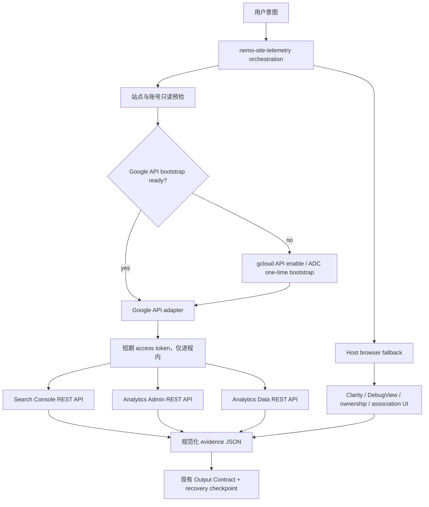
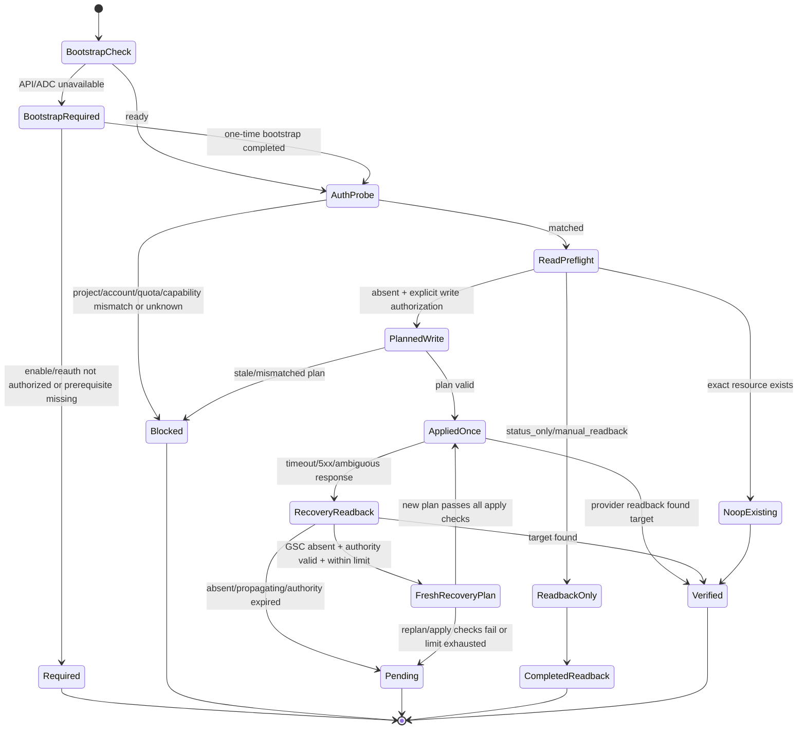

# Nemo Site Telemetry Google API Adapter 设计

## 结论

`nemo-site-telemetry` 继续作为唯一用户入口，不再拆出独立的 GSC 或 GA4 Skill。实现层新增一个受控的 Google API adapter：

- `gcloud` 只负责启用 API、建立 Application Default Credentials（ADC）和签发短期 access token；
- adapter 直接调用 Google 官方 REST API，输出稳定、可裁剪、无凭据的 JSON；
- 读取与写入使用不同命令、不同 OAuth scope 和不同门禁；
- GSC 写入首批只允许提交精确 sitemap，不提供 sitemap/property 删除；
- GA4 首批先提供 property/stream 发现与 Realtime 回读，再补精确 property/stream 创建；
- Clarity、GA4 DebugView、GSC ownership bootstrap 和 GA4↔GSC 关联保留浏览器回退，因为 API 不能完整覆盖这些证据面；
- “零点击”只承诺一次性 bootstrap 完成后的 steady state，不承诺从全新 Google 账号开始零人工授权。

这不是把第三方 MCP 直接塞进 Skill，而是先建立一个可测试的执行内核。未来若确实需要 MCP，可在同一内核外增加薄的 STDIO MCP shim，不复制认证、权限或业务判断。

## 实现与验证状态（2026-08-20）

- U1–U6 已实现；本地 contract、adapter、trigger、package 与 secret gates 均已通过；exact-copy 临时 feature branch 的 local release check 为 8 pass、1 个未发布 clean-install warning、0 block，canonical checkout 保持 default branch 且未发布。
- U7 目前只完成第 2 项：用现有 ADC 对 `sc-domain:quasimorphwiki.site` 执行限定日期窗口、`query` dimension、`FINAL` 数据的 Search Analytics 只读查询，返回 11 行，`row_limit_reached=false`，实际聚合类型规范化为 `BY_PROPERTY`。
- 第一次真实查询揭示 Discovery 声明的大写聚合枚举与 provider 返回的 lowerCamel `byProperty` 不一致。实现只接受四个已知 lowerCamel 别名并规范化为契约中的大写值；未知值继续 fail closed，并已有回归测试。
- 上述证据只覆盖受控 Search Analytics read primitive。GSC status-only、sitemap mutation/no-op/recovery、GA4 read/create/Realtime、Clarity、Google API bootstrap 写入和人工盲审仍是 `missing evidence`；Cloud/quota project 未设置，因此没有尝试这些写入或跨 provider 流程。

## 1. 背景与问题

当前 `nemo-site-telemetry` 已经定义了正确的治理语义：

- `status_only`、`manual_readback`、`submit_once`、`recovery_readback` 四种 sitemap 模式；
- 精确资源先查后写；
- 写操作超时后先 read-after-write；
- sitemap 提交、下载、抓取和索引分别取证；
- routine analytics reporting 与 SEO 机会分析不属于本 Skill。

目前缺少的是确定性执行面。现有 provider 操作主要依赖浏览器，第三方 MCP 又存在明显差异：

- `ncosentino/google-search-console-mcp` 固定为 `webmasters.readonly`，没有 sitemap submit；
- `AminForou/mcp-gsc` 暴露 submit/delete 等更宽能力；
- `pijusz/mcp-gsc` 默认只读，但可通过环境变量整体开启写工具；
- Google 官方 Analytics MCP 使用 `analytics.readonly`，能读报告和 metadata，不能创建 property/stream。

如果直接依赖其中任意一个，Skill 的行为会被外部工具的版本、scope 和工具清单反向决定，无法稳定落实当前的 intent matrix、证据层级和删除禁区。

## 2. 目标

### 2.1 功能目标

1. 同一个 Skill 支持 Google API bootstrap、GSC onboarding/readback、GA4 onboarding/readback。
2. bootstrap 完成后，Codex 无需进入 Google 控制台即可完成允许的 list/get、Realtime 和 sitemap submit/readback。
3. GSC 只读请求在代码层绝不进入 submit 路径。
4. 每个外部写操作都先形成精确计划、执行一次、再回读。
5. adapter 输出可直接映射到现有 `Output Contract`，不把 HTTP 成功冒充 provider 完成。
6. 浏览器和 API 可以混合取证，但每项证据必须注明来源。

### 2.2 安全目标

1. access token、refresh token、service-account private key、cookie 和 verification token 不进入 stdout、报告、仓库或测试夹具。
2. adapter 不实现删除 GSC property/sitemap、删除 GA4 property/stream、修改用户权限或邀请用户。
3. 账号、Cloud project、GA account/property、GSC property 与 production origin 必须精确匹配；相似名称不能自动选中。
4. 超时或 5xx 后不立即重放写请求。
5. 没有 provider-backed 端到端证据时继续标记 `missing evidence`。

### 2.3 非目标

- 不把本 Skill 扩展成日常 GA4/GSC 报表分析器。
- 不实现关键词机会、CTR 优化或排名诊断；这些仍由相应 SEO Skill 处理。
- 不把 URL Inspection 当成“请求收录”。
- 不接入 Google Indexing API。
- 不自动创建 service-account key，不把 key 下载到仓库。
- 不自动提升 GSC/GA4 权限，不执行 user link、owner 或邀请管理。
- 不在第一版自动处理 GSC ownership DNS token、nameserver/DNSSEC 或 GA4↔GSC 后台关联。
- 不替换现有 Clarity 浏览器流程。

### 2.4 威胁模型与信任边界

本 adapter 解决的是误操作、陈旧状态、目标漂移、重复写入和日志泄密，不把本地 plan 当成不可伪造的授权票据。它信任当前操作系统用户、Skill orchestration 进程和被解析到的 `gcloud`/Python 运行时；不防御已经取得同一宿主用户权限、可直接读取 ADC 或自行调用 Google API 的恶意本地进程。

因此安全性不依赖“plan 文件无人能修改”，而依赖以下 fail-closed 约束：

- plan 只描述候选动作，不授予动作；apply 时仍需重新验证用户授权依据、operation mode、target fingerprint、TTL 和 provider 当前状态；
- plan digest 只用于发现意外损坏或流程漂移，不宣称能抵抗同用户恶意篡改；
- 任何无法可靠归因的身份、scope、resource role、quota project 或 provider 结果都返回 `unknown|blocked|pending`，不能按成功处理；
- 宿主、账号或本地 credential broker 已被攻陷不在本设计可提供的安全边界内，应撤销凭据并走人工恢复。

## 3. 核心设计决策

### D1：一个 Skill，内部拆执行模块

用户继续调用 `$nemo-site-telemetry`。GA4、Clarity、GSC 仍是同一 onboarding 工作流里的独立工作单元，不新增第二个 discoverable `SKILL.md`。

内部模块按 provider 和权限拆分，避免把“一个 Skill”误解成“一个拥有所有权限的脚本”。

### D2：adapter-first，暂不把第三方 MCP 设为运行时依赖

第一版由 Skill 调用本地 CLI adapter。原因：

- CLI 可以只暴露本 Skill 允许的操作；
- JSON contract、redaction、错误分类和 read-after-write 可由本地测试固定；
- 不需要执行 `npx ...@latest` 或信任第三方 MCP 的后续工具变更；
- 当前包可以继续保持不依赖旧 `nemo-gsc-submit` Skill。

如果未来需要 Codex、Claude 和其他客户端共享同一工具面，再增加一个薄 MCP shim；shim 只做 schema/transport 转换，所有逻辑仍调用 adapter 内核。

### D3：`gcloud` 是 bootstrap 和 credential broker，不是业务客户端

当前 `gcloud` 没有常规 `gcloud search-console` 或 `gcloud analytics` 命令组。它承担：

1. 选择并确认 Cloud project；
2. 启用 `searchconsole.googleapis.com`、`analyticsadmin.googleapis.com`、`analyticsdata.googleapis.com`；
3. 建立或读取 ADC；
4. 为每次操作签发短期 token；
5. 为用户 ADC 请求提供 quota project。

实际 GSC/GA4 调用由 adapter 通过官方 REST endpoint 完成。

### D4：读取与写入按 operation 选择最小 scope

| 能力 | OAuth scope | 额外 provider 权限 |
|---|---|---|
| GSC sites/sitemaps/URL Inspection 读取 | `webmasters.readonly` | 对精确 property 有读取权限 |
| GSC sitemap submit | `webmasters` | 对精确 property 有足够写权限 |
| GA4 account/property/stream/Realtime 读取 | `analytics.readonly` | 对精确 account/property 有查看权限 |
| GA4 property/stream 创建 | `analytics.edit` | 对目标 GA account 有相应管理权限 |

有效能力始终是以下交集：

```text
Google API 支持
∩ adapter allowlist
∩ access token scope
∩ provider resource role
∩ 当前用户意图授权
```

scope 不足不能通过切换账号、扩大 scope 或回退浏览器盲点选来自动修复。

当前实现面固定到 Google 官方 Discovery 文档中已核验的版本，不使用 `latest`：

| provider surface | 固定版本/路径 | 本设计使用的方法 |
|---|---|---|
| Search Console sites/sitemaps/Search Analytics | `webmasters/v3` | sites get/list；sitemaps get/list/submit；受控 searchAnalytics query |
| Search Console URL Inspection | `v1` | `urlInspection.index:inspect` |
| Analytics Admin | `v1beta` | accountSummaries list；properties get/list/create；dataStreams get/list/create |
| Analytics Data | `v1beta` | `properties.runRealtimeReport` |

GA4 property create body 只提交 `parent=accounts/{id}`、`displayName`、`timeZone` 和 `currencyCode`；Web stream create 使用 URL parent `properties/{id}`，body 固定 `type=WEB_DATA_STREAM`、`displayName`、`webStreamData.defaultUri=<canonical production origin>`。不发送 output-only 字段。实现时把 endpoint、HTTP method、scope 和必要 request fields 固定成测试 fixture，并记录官方 Discovery revision；升级版本必须单独改 fixture、测试和官方来源日期。

### D5：第一版写 allowlist 极小化

允许：

- `webmasters.sitemaps.submit`；
- 后续阶段的 `analyticsadmin.properties.create`；
- 后续阶段的 `analyticsadmin.properties.dataStreams.create`。

不实现：

- GSC sitemap/property delete；
- GA4 property/stream delete 或 patch；
- GA4 userLinks/accessBindings；
- GSC owner/permission 管理；
- 任意通用 HTTP/Google API passthrough。

### D6：所有写入采用 plan → apply → readback

plan 不是用户授权的替代品，只是防止目标漂移和重复写入。

1. `plan` 精确读取目标资源并产生无凭据 plan；
2. Skill 根据用户原始请求和 `operation_mode` 形成独立的 authorization basis；plan 本身不能提升权限；
3. `apply` 再次验证 operation mode、authorization basis fingerprint、target fingerprint、10 分钟 TTL、operation allowlist 和 exact current absence；
4. `apply` 要求 orchestration 传回 plan 创建时返回的 canonical SHA-256，以发现意外损坏或换件；
5. 验证通过后只执行一次；
6. 立即 list/get 回读；
7. 请求结果不明确时进入 `recovery_readback`，不直接重试，也不复用旧 plan。

authorization basis 只包含 `authorization_kind`、允许的 action、operation mode、target fingerprint、`authorized_at` 和 `expires_at`，不保存用户原话、邮箱或 token。apply 必须同时拿到 plan 和当前 task orchestration 中的 authorization fingerprint；任一缺失或不一致都拒绝写入。

临时目录由 adapter 建立为 `0700`；plan 通过同目录临时文件原子写入，最终文件为 `0600`。创建和读取都拒绝 symlink、非普通文件、非当前用户 owner、group/world 可写目录及过宽权限。成功、失败和受控退出时清理 plan；进程被强杀后的残留 plan 仍受 TTL、owner、mode、digest 和 apply 再验证约束。

plan 存放在本次任务的临时目录，不写入仓库。长期 checkpoint 只保留目标 fingerprint、状态、时间和下一步，不保存 token 或 credential path。

## 4. 总体架构



### 4.1 证据来源规则

| 结论 | 首选证据 | 回退 |
|---|---|---|
| GSC property/sitemap 状态 | Search Console API | GSC UI |
| sitemap 已提交 | submit 后 list/get 回读 | GSC UI 列表回读 |
| GSC Search Analytics 查询能力/限定窗口 rows | Search Console API | 专门 SEO 流程；不把 rows 当成完整导出或 indexing 证据 |
| URL 当前索引状态 | URL Inspection API | GSC URL Inspection UI |
| GA4 property/stream | Analytics Admin API | GA4 Admin UI |
| GA4 Realtime | Analytics Data API `runRealtimeReport` | GA4 Realtime UI |
| GA4 DebugView | 不由 API 声称 | GA4 DebugView UI |
| GSC ownership bootstrap | 现阶段不自动化 | GSC + DNS UI/provider |
| GA4↔GSC 关联 | 现阶段不自动化 | GA4 Admin UI |
| Clarity setup/recording | 无本 adapter API | Clarity UI + Network |

### 4.2 Browser fallback 不是权限旁路

浏览器回退继承相同的 target fingerprint、intent matrix 和 provider claim guard。它只能执行当前 Skill 已允许且能精确定位的 onboarding/readback 动作；API unavailable 不会自动扩大浏览器权限。

硬阻断动作包括删除 provider 资源、修改或邀请用户、提升权限、切换到未经确认的账号/organization、变更 billing，以及编辑目标站点之外的资源。浏览器若出现账号、property 或 organization 不匹配，必须停在 `blocked`，不能选择名称相近的资源继续。浏览器发生写入超时或页面状态不明时，同样先回读，不重复点击。

## 5. 计划目录结构

```text
skills/nemo-site-telemetry/
├── scripts/
│   ├── google_api_adapter.py       # CLI、参数校验、命令分发
│   └── google_api/
│       ├── __init__.py
│       ├── auth.py                 # gcloud ADC/token，禁止输出 token
│       ├── http.py                 # urllib REST、quota header、错误裁剪
│       ├── gsc.py                  # GSC allowlist 与 sitemap 状态机
│       ├── ga4.py                  # GA4 Admin/Data allowlist
│       ├── plans.py                # plan fingerprint、TTL、apply 校验
│       └── output.py               # schema、redaction、checked_at
├── contracts/
│   └── google-api-output.schema.json
├── references/
│   └── google-api.md               # bootstrap、scope、错误与回退说明
├── tests/
│   ├── test_contract.py
│   ├── test_google_api_contract.py # schema、exit code、redaction
│   ├── test_google_api_adapter.py  # 全 mock，不使用真实凭据
│   └── fixtures/google_api/        # credential-free command fixtures
├── evals/
│   ├── trigger_cases.json
│   └── output_cases.json
└── reports/
    └── ...                         # 由现有 release/eval 工具生成
```

不新增 runtime `SKILL.md`，不把第三方 MCP 仓库或 service-account JSON vendor 进包。

### 5.1 运行前置与降级契约

- Python 基线为 3.11+，adapter 仅使用标准库；低于基线时在发起网络请求前返回 `prerequisite_missing`。
- `gcloud` 是可选外部能力，不是 `manifest.json.dependencies` 中的 Skill 依赖。初始参考环境为本机已核验的 Google Cloud SDK 568.0.0；实现不只按版本号放行，而会探测所需子命令及 `--scopes`、`--project`、`--impersonate-service-account` 等实际能力。
- `gcloud` 缺失或不兼容时不自动安装、不回退到更宽 scope，也不执行隐式浏览器写入；Google API provider mode 标为 `blocked`，由 Skill 按现有契约降级到允许的 browser/manual flow。
- `agents/interface.yaml` 的 subprocess 权限需显式覆盖 `python3` adapter、受控 `gcloud` 子命令和官方 Google endpoint；`manifest.json.dependencies=[]` 继续表示没有 Skill-to-Skill 运行时依赖，而不是“无需 Python/gcloud”。
- CLI 入口固定为 `python3 <skill-root>/scripts/google_api_adapter.py ...`。不依赖当前工作目录，不执行 `npx ...@latest`，不动态下载包。

## 6. CLI contract

所有命令：

- stdout 只输出一份 JSON；
- stderr 只输出无凭据诊断；
- 非零退出码表示命令未满足 contract；
- `--debug` 也不得输出 Authorization header、token、cookie、credential JSON 或 verification value；
- 默认不写文件；只有 `plan` 使用显式 `--output` 写入临时目录。

稳定退出码：

| exit code | 含义 |
|---|---|
| `0` | completed、verified 或 noop；stdout 仍给出完整 JSON |
| `2` | CLI 参数/输入 contract 无效，尚未访问 provider |
| `10` | Python/gcloud/API enable/ADC 等前置缺失 |
| `11` | capability、账号、scope、quota project 或 resource access 不可用/无法确定 |
| `12` | target、authorization、plan、TTL 或 digest 校验失败 |
| `13` | provider transient/ambiguous，结果保持 pending |
| `14` | provider 明确拒绝或请求永久失败 |
| `15` | 已安全裁剪的内部错误；默认不输出 traceback |

命令失败时也只允许一份符合 schema 的 stdout JSON；stderr 仅用于固定长度、已脱敏的人类诊断。调用方依据 exit code 和 JSON 状态共同判断，不能只看一边。

### 6.1 Bootstrap 与认证

```bash
python3 scripts/google_api_adapter.py bootstrap status \
  --project-id PROJECT_ID \
  --quota-project-id QUOTA_PROJECT_ID
python3 scripts/google_api_adapter.py bootstrap enable-apis \
  --project-id PROJECT_ID \
  --quota-project-id QUOTA_PROJECT_ID
python3 scripts/google_api_adapter.py auth probe --capability gsc-read
python3 scripts/google_api_adapter.py auth probe --capability gsc-sitemap-submit
python3 scripts/google_api_adapter.py auth probe --capability ga4-read
python3 scripts/google_api_adapter.py auth probe --capability ga4-admin-write
```

`bootstrap enable-apis` 是独立的 Google Cloud 外部写操作，只在用户明确要求配置 Google API 时执行；普通 `status`、provider readback 或 onboarding 检查绝不隐式调用它。执行前必须精确回显并确认 Cloud project ID 与 quota project ID，读取三项 service 当前状态；执行后逐项 readback，只有目标 project 上全部启用才标记 completed。缺少 `serviceusage.services.enable` 或 quota project 上的 `serviceusage.services.use` 时 fail closed。

`auth probe` 通过对应 capability 的真实 allowlist API 调用判断 `available|unavailable|unknown`，不调用 tokeninfo 并回显身份或 scope 详情。成功调用可以证明该 capability 当前 available；一般 403 不能可靠区分 OAuth scope 不足与 resource role 不足。只有 provider 返回明确的 scope-specific reason 时才标记 `scope_status=insufficient`，只有明确的 resource-permission reason 时才标记 `resource_access=insufficient`；其余 403 两者都保持 `unknown` 并阻断写入。

### 6.2 GSC 读取

```bash
python3 scripts/google_api_adapter.py gsc list-sites
python3 scripts/google_api_adapter.py gsc get-site --site-url 'sc-domain:example.com'
python3 scripts/google_api_adapter.py gsc list-sitemaps --site-url 'sc-domain:example.com'
python3 scripts/google_api_adapter.py gsc get-sitemap \
  --site-url 'sc-domain:example.com' \
  --sitemap-url 'https://example.com/sitemap.xml'
python3 scripts/google_api_adapter.py gsc inspect-url \
  --site-url 'sc-domain:example.com' \
  --inspection-url 'https://example.com/page/'
python3 scripts/google_api_adapter.py gsc search-analytics \
  --site-url 'sc-domain:example.com' \
  --start-date 2026-08-01 \
  --end-date 2026-08-19 \
  --dimension query \
  --row-limit 1000
```

adapter 提供受控 `searchAnalytics.query` 只读 primitive，但 root Skill 仍不因单纯排名、CTR、关键词或内容机会分析而触发；日常 GSC performance 判断继续由 SEO 分析流程负责。该 primitive 只允许日期、固定 dimensions/search/data/aggregation 枚举、row limit 与 offset，不开放任意 JSON、filters 或 hourly 查询。HTTP 虽为 POST，必须按 `read_only=True` 走有界读重试；输出明确 top aggregated rows 不是完整导出、稳定快照或 indexing 证据。

### 6.3 GSC sitemap 写入

```bash
python3 scripts/google_api_adapter.py gsc sitemap-plan \
  --operation-mode submit_once \
  --site-url 'sc-domain:example.com' \
  --sitemap-url 'https://example.com/sitemap.xml' \
  --output /tmp/.../gsc-sitemap-plan.json

python3 scripts/google_api_adapter.py gsc sitemap-apply \
  --plan /tmp/.../gsc-sitemap-plan.json \
  --expected-plan-sha256 PLAN_SHA256 \
  --authorization-fingerprint AUTHORIZATION_FINGERPRINT
```

`sitemap-plan` 必须同时验证：

1. operation mode 为 `submit_once` 或仍持有原授权的 `recovery_readback`；
2. site URL 是 API 返回的精确 property identifier；
3. 公网 sitemap 返回成功、为非空可解析 XML；
4. sitemap URL 位于 property 范围内；
5. exact list/get 当前为 absent；
6. 当前身份与目标 property 权限匹配。

若 sitemap 已存在，plan 返回 `action=noop_existing`，不产生可 apply 的写计划。

`status_only` 和 `manual_readback` 在 CLI 层拒绝生成写计划，即使当前 token 拥有 `webmasters` scope。

`sitemap-apply` 不信任 plan 中的检查结果。它必须重新 list/get，确认 exact sitemap 此刻仍 absent，并重新计算 authorization/target fingerprint、TTL 和 digest；任何变化都要求重新 plan，不能带着旧 plan 继续。

### 6.4 GA4 读取

```bash
python3 scripts/google_api_adapter.py ga4 list-account-summaries
python3 scripts/google_api_adapter.py ga4 get-property --property-id PROPERTY_ID
python3 scripts/google_api_adapter.py ga4 list-web-streams --property-id PROPERTY_ID
python3 scripts/google_api_adapter.py ga4 realtime \
  --property-id PROPERTY_ID \
  --metric activeUsers
```

Realtime 命令只允许 Skill 验证所需的有限 metrics/dimensions，不开放任意报表查询语言，避免变成 routine analytics 工具。

### 6.5 GA4 精确创建

GA4 创建在 GSC/GA4 readback 稳定后实现，仍属于本设计的目标状态：

```bash
python3 scripts/google_api_adapter.py ga4 resource-plan \
  --account-id ACCOUNT_ID \
  --production-origin 'https://example.com' \
  --display-name 'Example' \
  --time-zone 'Asia/Shanghai' \
  --currency-code 'USD' \
  --output /tmp/.../ga4-resource-plan.json

python3 scripts/google_api_adapter.py ga4 resource-apply \
  --plan /tmp/.../ga4-resource-plan.json \
  --expected-plan-sha256 PLAN_SHA256 \
  --authorization-fingerprint AUTHORIZATION_FINGERPRINT
```

约束：

- `account-id`、time zone、currency 不允许猜测；
- 精确匹配现有 property + web stream 时返回 `noop_existing`；
- 缺 property 时最多创建一个 property；
- 缺 stream 时最多创建一个 Web stream；
- 创建后用 Admin API get/list 回读；
- 不创建 Analytics account，不授予用户权限，不修改已有 property；
- 当前身份没有 account 级管理权限时返回 `blocked`，不尝试自授权。

### 6.6 Canonicalization 与 fingerprint

target fingerprint 使用 canonical JSON 的 SHA-256，至少绑定：provider、resource type、provider 返回的 immutable resource ID/name、canonical production origin、operation，以及该动作涉及的 exact sitemap URL/account/property/stream ID。fingerprint 不含邮箱、credential path 或 token。

规范化规则必须显式、可测试：

- production origin 只接受绝对 `http|https` origin，拒绝 userinfo/query/fragment；scheme/host 小写、IDN 转 ASCII、移除默认端口，path 必须是 `/`；
- `sc-domain:example.com` 与 URL-prefix property 是不同 resource type，永不互相转换或“升级匹配”；domain property 只规范化域名大小写/IDN，URL-prefix 保留 scheme、端口和 API 返回的 prefix 语义；
- sitemap/inspection URL 先解析为绝对 URL，再按对应 property 的覆盖范围校验；不得解码再编码 path、折叠有语义的 slash，或用字符串前缀代替 origin/prefix 解析；
- GA4 使用 `accounts/{id}`、`properties/{id}`、`properties/{id}/dataStreams/{id}` 的完整 immutable resource name；display name 只用于展示，不能进入身份匹配；
- apply 时以 provider 最新返回的 immutable name 与 canonical origin 重新计算 fingerprint，不能只复用 plan 内字符串。

## 7. 认证与 bootstrap

### 7.1 支持模式

1. `adc_user`：本机个人操作默认。首次运行 `gcloud auth application-default login`，之后 adapter 零点击获取短期 token。
2. `adc_service_account`：已有 service account credential 时，通过 `GOOGLE_APPLICATION_CREDENTIALS` 指向仓库外安全路径。Skill 不创建、不读取到输出、不复制该文件；只有路径和文件安全检查通过才允许使用。
3. `impersonation`：已有 IAM 条件时优先于长期 JSON key，由用户 ADC 代理 service account；Skill 不自动授予 Token Creator。

本设计不把 service-account JSON 定义为默认必需品。对本机个人 Codex，用户 ADC 通常更简单；对长期自动化，优先 impersonation，其次才是已有且受控的 service-account credential。

service-account credential path 必须满足：位于所有项目仓库/worktree 之外；路径组件不是 group/world writable 的共享目录；目标是当前用户拥有的 regular file，不是 symlink；权限为 `0600` 或更严格。任一条件无法验证时返回 blocked，错误输出只说违反的规则，不打印路径或 JSON 内容。adapter 不主动搜索磁盘上的 credential 文件。

### 7.2 一次性人工边界

以下操作不能宣传为“从零零点击”：

- 首次 Google OAuth 登录/consent；
- 选择并确认 Cloud project；
- 让身份具备 `serviceusage.services.use`；
- 把 service account 加入现有 GSC property 或 GA4 account/property；
- 首次 GSC ownership/DNS verification；
- 当前 API 不覆盖的 GA4↔GSC 关联。

这些 bootstrap 完成后，日常状态回读、Realtime 和已授权的 sitemap submit 可以零 dashboard 点击执行。

### 7.3 Token 处理

- adapter 以 subprocess 捕获 `gcloud auth application-default print-access-token --scopes=...`；
- 每条顶层命令按单一 capability 单独请求 token；write token 不跨命令、provider、operation 或 recovery plan 缓存/复用；
- token 只保存在当前进程内存，调用结束即丢弃；
- 不把完整命令输出转发到日志；
- 用户 ADC 只有在精确 quota project 已确认且当前身份具备 `serviceusage.services.use` 时才携带 `X-Goog-User-Project`；缺失或拒绝时返回 `quota_project_status=missing|denied`，不能静默省略 header 后继续写；
- service account/impersonation 是否携带 quota header 由显式配置决定，不从 credential 文件路径或邮箱猜测；
- 认证失败只输出分类和下一步，不输出 subject email 或 credential path；
- access token 默认使用 Google 的短期 lifetime，不主动延长。

### 7.4 Safe-error serializer

所有异常都先进入 `output.py` 的集中式 serializer，再到 stdout/stderr。默认禁止 traceback；只有本地单元测试可在不含真实 provider 数据的 fixture 上启用结构化 debug。

serializer 对 subprocess stdout/stderr、HTTP headers/body、JSON decode errors 和 validation errors 统一执行：

1. 只保留 allowlist 字段，如内部 `error_code`、HTTP status、Google reason、retryable、next step；
2. 限制单字段和总消息长度，原始 body/header 不透传；
3. 第一层按字段名清除 Authorization、cookie、token、secret、credential、verification 等值；
4. 第二层按内容模式清除 bearer token、JWT、PEM/private key、OAuth code、GSC verification value 和 credential path；
5. serializer 自身失败时只返回固定的 `safe_serialization_failed`，不回退打印原始异常。

secret-redaction 测试必须同时覆盖 stdout、stderr、unittest failure message 和生成的 report fixture。

## 8. 输出契约扩展

保留现有 `site_preflight`、`ga4`、`clarity`、`gsc`、`recovery_checkpoint` 字段；新增可选的 `google_api` 执行面，不破坏旧输出：

每条 CLI 命令的 stdout 使用同一个顶层 JSON envelope；schema 的 required fields 固定为：

```yaml
schema_version: string
adapter_version: string
command: string
status: completed|verified|noop|required|blocked|pending|failed
checked_at: RFC3339 timestamp
google_api: object
target: object|null
evidence: array
result: object|null
plan: object|null
error: object|null
```

字段约束：

- `target` 只包含 `resource_type`、可选 exact immutable `resource_name`、canonical origin/property/sitemap URL 和 `target_fingerprint`；exact ID 可供同一执行流程使用，但进入最终 Skill 报告前默认 masked；
- `evidence[]` 每项固定包含 `surface=api|browser`、`provider_method`、`observed_at`、`status` 和 credential-free 摘要；apply 返回 `verified` 时至少有一项写后 list/get evidence；
- `plan` 只在 plan/noop 命令出现，包含 `action`、`operation_mode`、`target_fingerprint`、`authorization_fingerprint`、`plan_sha256`、`created_at`、`expires_at` 和输出文件状态，不包含 token/path/用户原话；
- `error` 在 `required|blocked|pending|failed` 时非空，只允许 `error_code`、安全的 `provider_status/reason`、`retryable` 和 `next_step`；成功状态必须为 null；
- `result` 按 command 使用 schema 中的 `oneOf` 子结构，不允许任意 provider body passthrough；若 GA4 create 回读出现多个候选，只输出 `candidate_count` 和候选 fingerprint/masked resource name，status 必须为 pending；
- serializer 在进程结束前只调用一次，stdout 末尾只允许一个换行；日志、progress 和 traceback 都不能混入 stdout。

```yaml
google_api:
  provider_mode: browser|google_api|mixed|none
  adapter_version: string
  auth_mode: adc_user|adc_service_account|impersonation|none|unknown
  api_project: matched|unknown|mismatch
  quota_project_status: matched|missing|denied|unknown|not_applicable
  account_subject: matched|unknown|mismatch
  capability_status: available|unavailable|unknown
  scope_status: matched|insufficient|unknown
  resource_access: matched|insufficient|unknown
  bootstrap_status: required|in_progress|completed|blocked|not_needed
  steady_state: zero_click|reauth_required|blocked|not_applicable
  api_readback: verified|pending|failed|not_attempted
  checked_at: RFC3339 timestamp
```

每个组件增加证据来源：

```yaml
ga4:
  readback_surface: api|browser|mixed|not_checked
gsc:
  readback_surface: api|browser|mixed|not_checked
```

约束：

- `account_subject` 只输出 matched/unknown/mismatch 枚举，不输出邮箱；
- 成功的 allowlist API 调用可把 capability、scope 和 resource access 标记为 matched/available；非特异 403 不得猜测是 scope 还是 resource role；
- target resource 可在执行期使用精确 ID，最终报告默认输出稳定 fingerprint 或 masked ID；
- Google 原始错误只保留安全的 reason/status，不保留 request headers/body 中的敏感字段；
- GA4 Realtime API 成功不等于 DebugView 成功；
- GSC URL Inspection 只证明 exact URL 的 inspection result，不证明发起收录请求。

## 9. 状态机



## 10. 错误分类与恢复

| 情况 | adapter 状态 | Skill 行为 |
|---|---|---|
| `gcloud` 不存在 | `bootstrap_status=blocked` | 保留 browser/generic fallback，给出精确安装前置，不自动安装 |
| API 未启用 | `bootstrap_status=required` | 仅在配置授权下执行 enable-apis |
| ADC 不存在/过期 | `steady_state=reauth_required` | 停止写入，要求一次人工 reauth |
| 401 | `auth_failed` | 不重试写入，不切换账号 |
| 403，明确 scope-specific reason | `scope_status=insufficient` | 停止；不自动扩大 scope |
| 403，明确 resource-permission reason | `resource_access=insufficient` | 停止；指出需在目标资源授权 |
| 403，原因不可区分 | `scope_status=unknown` + `resource_access=unknown` | 停止；报告 capability unknown，不猜测修复路径 |
| quota project 缺失/无 `serviceusage.services.use` | `quota_project_status=missing|denied` | 停止 API 写入，不静默移除 quota header |
| 404 exact resource | `not_found` | 只读模式报告；写模式才进入 plan |
| 409/已存在 | `noop_existing` 或 readback | 复用并回读，不创建第二份 |
| 429 | `pending` + provider retry hint | 有界等待，只读重试优先 |
| GET/list 5xx/timeout | `pending` | 可有界重试读取 |
| POST/PUT 5xx/timeout | `ambiguous` | 进入 `recovery_readback`，禁止立即重放 |
| API 与浏览器账号结果冲突 | `blocked` | 输出 mismatch，不能选择“看起来对”的资源 |

所有重试使用有上限的指数退避和 jitter；写操作没有通用自动重试器。

### 10.1 模糊写入的精确恢复上限

- GET/list 可以在最长 60 秒窗口内最多尝试 3 次；每次结果和 `checked_at` 都进入内存中的 recovery trace，最终只输出裁剪后的摘要。
- GSC sitemap submit 是绑定 exact property + exact sitemap URL 的 PUT。首次结果 ambiguous 后先做上述 readback；仍 absent、原 authorization basis 仍有效、target fingerprint 未变且仍处于 `recovery_readback` 时，才可生成全新 plan。相同 authorization/target 在 15 分钟窗口内最多允许 1 次 recovery submit，随后再次 readback；再不确定就保持 pending，不自动回写。
- GA4 property/data stream create 不进入自动 recovery replay。POST 结果 ambiguous 时只允许按 exact account/origin/name 组合回读；找到唯一匹配资源则 verified，未找到或出现多个候选都保持 pending，要求人工确认后重新授权，避免重复创建。
- 任何恢复都不得复用旧 token 或旧 plan；原授权到期、账号/资源/quota 改变、readback 非唯一或最大窗口耗尽时立即停止。

## 11. 与现有 Skill 的集成

### 11.1 `SKILL.md`

只增加执行面路由和新增 output 字段，不把 API endpoint、命令大全塞进根入口。根入口继续负责：

- 触发与排除；
- intent matrix；
- G0–G7 gate；
- provider claim guard；
- browser/API fallback 选择。

### 11.2 `references/google-api.md`

承载：

- API service name 与 scope；
- bootstrap/ADC 说明；
- CLI 操作清单；
- 错误分类；
- browser fallback；
- “bootstrap 非零点击、steady state 零点击”的声明边界。

### 11.3 `references/gsc.md` 与 `references/ga4.md`

- `gsc.md` 将四种 operation mode 映射到 adapter 命令；
- `ga4.md` 增加 Admin/Data API 证据与 DebugView browser-only 边界；
- 现有 sitemap、crawl、index 和 production isolation 规则不变。

### 11.4 `agents/interface.yaml` 与 `manifest.json`

- 声明可选 `google_api` provider mode 和 `gcloud` tool requirement；
- 不声明第三方 MCP 运行时依赖；
- `dependencies` 继续不引用旧 Skill；
- `provider_or_human_output_evidence` 按 capability 声明：受控 GSC Search Analytics 只读查询已有真实 provider evidence；GA4、Clarity、sitemap mutation、bootstrap 写入、完整跨 provider onboarding 与人工盲审继续为 `missing evidence`。

## 12. 实施单元

### U1：锁定 contract 与 fixtures

文件：

- `contracts/google-api-output.schema.json`
- `references/google-api.md`
- `evals/output_cases.json`
- `tests/test_contract.py`
- `tests/test_google_api_contract.py`
- `tests/fixtures/google_api/*.json`

内容：先加入新字段、退出码、错误枚举、只读/写入边界和全 mock fixtures，再写执行代码。schema 是稳定输出的 source of truth；测试用标准库验证 required fields/enum 和单份 stdout JSON，不为此新增 runtime dependency。

完成条件：现有行为测试仍通过；新增测试先以明确缺实现方式失败。

### U2：认证与 HTTP 内核

文件：

- `scripts/google_api_adapter.py`
- `scripts/google_api/auth.py`
- `scripts/google_api/http.py`
- `scripts/google_api/output.py`
- `tests/test_google_api_contract.py`
- `tests/test_google_api_adapter.py`

内容：Python/gcloud capability 检测、ADC token 获取、quota project、scope 选择、REST、redaction、统一 JSON/exit code；覆盖无 gcloud、无 ADC、quota project denied、非特异 403 和 gcloud 568.0.0 已核验 flags 的兼容 contract。

完成条件：mock token/API 测试通过，secret scan 证明 token 不出现在 stdout/stderr/fixture。

### U3：GSC read + sitemap plan/apply/readback

文件：

- `scripts/google_api/gsc.py`
- `scripts/google_api/plans.py`
- `tests/test_google_api_adapter.py`
- `tests/fixtures/google_api/gsc-*.json`
- `references/gsc.md`

内容：sites/sitemaps/inspection 读取、受控 Search Analytics 只读查询、public sitemap 预检、canonicalization、plan 文件完整性、四模式门禁、submit once、ambiguous write recovery。

完成条件：Search Analytics 只能使用 `gsc-read`、固定参数与 semantic-read POST；`status_only` 和 `manual_readback` 无法到达写 endpoint；existing 为 no-op；write timeout 先 list/get。

### U4：GA4 readback

文件：

- `scripts/google_api/ga4.py`
- `references/ga4.md`
- `tests/test_google_api_adapter.py`
- `tests/fixtures/google_api/ga4-*.json`

内容：account/property/stream 精确发现与有限 Realtime；DebugView 明确 browser-only。

完成条件：API 读取能映射到现有 `ga4.setup`/`ga4.realtime`，且不会触发 routine report 分析。

### U5：GA4 property/stream plan/apply

文件：

- `scripts/google_api/ga4.py`
- `scripts/google_api/plans.py`
- `tests/test_google_api_adapter.py`
- `tests/fixtures/google_api/ga4-create-*.json`
- `references/google-api.md`
- `references/ga4.md`

内容：精确 account、时区、币种和 origin 输入；create-only allowlist；写后 get/list；无 patch/delete/user link。

完成条件：existing no-op；输入不完整 blocked；account 权限不足不自授权；创建结果有 provider readback。

### U6：文档、Skill IR 与 package gates

文件：

- `SKILL.md`
- `README.md`
- `agents/interface.yaml`
- `manifest.json`
- `references/official-sources.md`
- `tests/test_contract.py`
- `tests/test_google_api_contract.py`
- `reports/skill-ir.json`
- generated eval/release reports

内容：更新 Skill 路由、运行前置、browser fallback allowlist、权限声明和 provider evidence；增加“分析请求不触发 adapter”“browser fallback 不扩大写权限”的回归测试。

完成条件：validate、contract tests、trigger eval、output eval、Skill IR、secret scan 和 local release check 全部通过。

### U7：授权环境端到端验证

使用专门测试资源或用户明确授权的精确现有资源，按能力独立验证：

1. [ ] GSC status-only；
2. [x] GSC Search Analytics 限定窗口只读查询；
3. [ ] exact sitemap absent → submit once → list/get；
4. [ ] 重复执行变为 no-op；
5. [ ] GA4 property/stream readback；
6. [ ] GA4 Realtime readback；
7. [ ] 若账号权限允许，验证一次 GA4 create-only 流程；
8. [ ] 断网/timeout 后 recovery readback。

第 2 项于 2026-08-20 对 `sc-domain:quasimorphwiki.site` 完成真实只读验证；原始 query 行未写入包内报告。U7 仍是 partial：只有该受控 capability 可声明 provider-backed verified，其余项目继续标记 `missing evidence`，不能把局部通过描述成完整 onboarding 端到端验证。

## 13. 测试矩阵

至少新增以下 contract/output cases：

- `bootstrap_api_disabled`
- `bootstrap_status_never_enables_api`
- `bootstrap_enable_exact_project_readback`
- `gcloud_missing_browser_fallback`
- `adc_missing_requires_human_login`
- `adc_scope_insufficient_no_auto_expand`
- `adc_403_cause_unknown_blocks_write`
- `quota_project_permission_denied`
- `service_account_path_symlink_rejected`
- `service_account_path_in_repo_rejected`
- `api_account_mismatch_blocks_write`
- `gsc_status_only_with_write_capable_token`
- `gsc_manual_readback_with_missing_sitemap`
- `gsc_submit_existing_noop`
- `gsc_submit_absent_apply_once`
- `gsc_submit_timeout_then_found`
- `gsc_submit_timeout_then_single_recovery_limit`
- `gsc_submit_timeout_then_absent_authority_expired`
- `plan_expired_rejected`
- `plan_symlink_rejected`
- `plan_owner_mismatch_rejected`
- `plan_mode_too_open_rejected`
- `plan_parent_directory_group_or_world_writable_rejected`
- `plan_digest_mismatch_rejected`
- `plan_target_changed_rejected`
- `plan_authorization_fingerprint_mismatch_rejected`
- `plan_operation_mode_mismatch_rejected`
- `plan_action_not_in_allowlist_rejected`
- `ga4_property_stream_existing`
- `ga4_create_missing_timezone_or_currency`
- `ga4_create_account_permission_denied`
- `ga4_create_ambiguous_never_auto_replayed`
- `ga4_realtime_api_without_debugview`
- `browser_api_evidence_conflict`
- `secret_redaction_token_in_provider_error`
- `safe_error_redacts_subprocess_http_json_and_traceback`
- `seo_analysis_request_never_invokes_adapter`
- `browser_fallback_delete_permission_and_account_switch_blocked`

测试不得读取真实 ADC、真实 service-account JSON 或 provider 账号。真实运行只进入 credential-free evidence report。

### 13.1 确定性验证命令

从 canonical Skill 目录执行：

```bash
python3 -m unittest discover -s tests -p 'test_*.py'
python3 scripts/google_api_adapter.py --help
```

adapter 测试必须在 Python 模块层注入 fake subprocess、fake clock 和 fake HTTP transport，并由 unittest 直接调用 command dispatcher；生产 CLI 不提供可误用的 `--fixture` 或 fake transport 参数。上述确定性命令不读取 gcloud、ADC 或真实 Google。授权环境的 `bootstrap status` 只属于 U7，不能混入 CI/package gate。package gate 从 `qiaomu-meta-skill` canonical 目录执行：

```bash
python3 scripts/validate_skill.py /path/to/nemo-site-telemetry
python3 scripts/export_skill_ir.py /path/to/nemo-site-telemetry --output /path/to/nemo-site-telemetry/reports/skill-ir.json
python3 scripts/trigger_eval.py /path/to/nemo-site-telemetry --cases /path/to/nemo-site-telemetry/evals/trigger_cases.json --output /path/to/nemo-site-telemetry/reports/trigger-eval.json
python3 scripts/release_check.py /path/to/nemo-site-telemetry --phase local --run-tests
```

实现时用实际 canonical absolute path 替换 `/path/to/nemo-site-telemetry`；不从网络安装依赖。授权环境 U7 是独立验证，不混入 unit/package gate。

## 14. 验收标准

设计实现完成必须同时满足：

1. 用户只问状态时，任何执行路径都不会调用 Google 写 endpoint。
2. GSC submit 只能针对精确 property + sitemap URL，且先确认 absent。
3. submit 响应超时后第一次后续动作是 list/get。
4. 重复执行同一 sitemap onboarding 得到 no-op，不产生重复外部变更。
5. GA4 readback 与 DebugView 声明严格分离。
6. GA4 create 不猜 account、timezone、currency 或 production origin。
7. 所有命令输出都符合 JSON schema，包含 `checked_at` 与 evidence source。
8. token、key、cookie、verification value 不进入 repo、日志、报告或测试失败输出。
9. README/manifest 按 capability 声明 evidence：没有真实 provider run 的能力保留 `missing evidence`，局部 provider run 不能扩大成完整 onboarding 证据。
10. browser fallback 仍可工作；移除 adapter 不会破坏现有手动恢复流程。
11. 普通 status/readback 命令不能隐式启用 API；enable-apis 的 exact project 在执行前后都有 readback。
12. 一般 403 不被武断归因为 scope 或 resource role；未知原因会阻断写入。
13. plan 的 symlink、owner/mode、TTL、digest、authorization 和 target 漂移任一校验失败都不会访问写 endpoint。
14. GSC ambiguous submit 的 recovery replay 最多一次；GA4 ambiguous create 永不自动 replay。
15. `gcloud` 缺失/不兼容时输出稳定降级状态，不自动安装或扩大浏览器动作面。

## 15. 回滚设计

代码回滚只需：

- 把 provider mode 退回 `browser`；
- 移除 adapter 路由与脚本；
- 恢复旧 output contract 的可选字段处理。

回滚前先清理本次任务仍存在的临时 plan；若异常残留，按精确 `0700` task temp directory 清单删除，而不是递归清理通用 `/tmp`。不删除 ADC、service-account credential、gcloud 配置或 quota project 设置。

回滚不自动删除任何已经创建的 GSC/GA4 资源，不删除 sitemap，不删除 ownership TXT。若 adapter 在一次写调用中断后被回滚，仍必须先用 browser/API 回读真实外部状态。

## 16. 先例取舍

| 先例 | Keep | Adapt | Reject |
|---|---|---|---|
| `ncosentino/google-search-console-mcp` | 小而清晰的只读 surface、`webmasters.readonly` | list/get/inspection schema | 没有 submit，无法完成已授权 onboarding |
| `AminForou/mcp-gsc` | submit 后读取详情的思路 | sitemap submit 能力 | 广泛 `webmasters` surface 和删除工具进入默认执行面 |
| `pijusz/mcp-gsc` | 写能力默认关闭 | 显式 write gate | 同时暴露 submit/delete、额外 indexing scope |
| Google Analytics MCP | 官方 read-only scope、Admin/Data 读取 | property/Realtime 结果结构 | 把“使用 Admin API”误认为支持 Admin 写入 |

本设计新增的核心贡献是：把现有用户意图门禁、最小 API allowlist、plan/apply/readback、credential-free evidence 和 browser fallback 统一到一个跨站点 Skill 内。

## 17. 官方依据

- [Search Console Search Analytics query](https://developers.google.com/webmaster-tools/v1/searchanalytics/query)
- [Search Console API Discovery](https://github.com/googleapis/google-api-go-client/blob/main/searchconsole/v1/searchconsole-api.json)（核验 revision `20260819`）
- [Analytics Admin API v1beta Discovery](https://github.com/googleapis/google-api-go-client/blob/main/analyticsadmin/v1beta/analyticsadmin-api.json)（核验 revision `20260802`）
- [Analytics Data API v1beta Discovery](https://github.com/googleapis/google-api-go-client/blob/main/analyticsdata/v1beta/analyticsdata-api.json)（核验 revision `20241117`）
- [Search Console Sitemaps submit](https://developers.google.com/webmaster-tools/v1/sitemaps/submit)
- [Google Analytics Admin API REST](https://developers.google.com/analytics/devguides/config/admin/v1/rest)
- [Google Analytics Data API REST](https://developers.google.com/analytics/devguides/reporting/data/v1/rest)
- [Google Analytics MCP](https://github.com/googleanalytics/google-analytics-mcp)
- [Application Default Credentials](https://cloud.google.com/docs/authentication/provide-credentials-adc)
- [`gcloud auth application-default login`](https://cloud.google.com/sdk/gcloud/reference/auth/application-default/login)
- [`gcloud auth application-default print-access-token`](https://cloud.google.com/sdk/gcloud/reference/auth/application-default/print-access-token)
- [`gcloud services enable`](https://cloud.google.com/sdk/gcloud/reference/services/enable)

上述 Discovery revision 于 2026-08-20 从 `googleapis/google-api-go-client` 官方仓库核验，用于锁定本设计的 method/path/scope/request contract；实现或升级时必须重新核验，不把 revision 本身当成兼容性保证。

## 18. 推荐实施顺序

按 U1 → U2 → U3 → U4 → U5 → U6 → U7 顺序实施。当前 U1–U6 已完成，U7 仅第 2 项完成。

- v1 交付边界是 U1–U4：包含 GSC list/get/inspection、受控 Search Analytics 查询、精确 sitemap submit + readback，以及 GA4 property/stream/Realtime 只读回读；明确不包含 GA4 create。
- v2 交付边界是 U5–U6：增加 GA4 property/stream create-only，并补齐 Skill/package gates。
- U7 是独立的授权环境证据门，不改变 v1/v2 的代码范围；通过哪一项才可对外声称哪一项 provider-backed verified。

因此，v1 不是“纯只读版”：它唯一的外部业务写能力是经过 intent gate 的 GSC sitemap submit。GA4 Admin 写入在相同内核上继续实现，但在真实测试账号通过前不作为已验证能力宣传。
